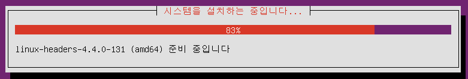

# 01_LINUX_SETUP

- 현재 사용하고 있는 OS에서 리눅스 사용을 하기 위해 Virtual Box를 설치하자.
  - Virtual Box는 가상화 환경을 만들어 사용하고 있는 OS 위에서 새로운 OS를 사용 가능하게 한다.

## 1. Virtual Box 설치

- [공식 사이트](http://www.virtualbox.org/)에 접속한 후

  

- **좌측의 Downloads를 클릭**

  

- **하단의  VirtualBox older builds를 클릭**

  - **안정성**을 위해서 older virsion을 받는 것이다.

  

- **VirtualBox 6.0을 클릭**

  

- Windows에 설치할 것이기 때문에 **Windows hosts**를 클릭해 다운로드 받자.
- 다운로드가 완료됐다면 경로를 찾아가서 설치해주도록 하자.
- 설치 중간에는 **모두 Yes를 눌러줘도 무방**하다.
- 설치가 완료됐다면 이제 리눅스 운영체제인 CentOS와 Ubuntu를 깔기 시작해보자.

## 2. CentOS

- [CentOS 6.10 다운로드](http://mirror.kakao.com/centos/6.10/isos/x86_64/)

  

- **CentOS-6.10-x86_64-bin-DVD1.iso**를 받자.

- 만약에 가지고 있는 iso파일이 있다면, 있는 것으로 사용하자.

### 2.1 VirtualBox에 가상 환경 추가

- VirtualBox를 실행하면 다음과 같은 화면을 볼 수 있다.
- **새로 만들기를 클릭하자.**

- 위와 같은 화면이 뜬다면 CentOS을 입력하고 다음을 눌러준다.
  - 이름을 입력할 시에 버전 종류를 자동으로 잡아준다.

- 다음으로 넘어오면 **메모리를 2048**을 입력해주고 넘긴다.

- **지금 새 가상 하드 디스크 만들기**를 **선택**하고 만들기를 누르고 넘긴다.

- **VDI를 선택하고 다음**으로 넘긴다.

- 동적 할당을 선택하고 다음으로 넘긴다.
  - **동적 할당** : 바로 해당 용량이 할당 되는게 아니라 용량이 커질 때마다 크기가 최대 지정 크기까지 커진다.
  - **고정 크기** : 처음부터 해당 용량을 할당하고 사용한다. 속도가 조금 더 빠르지만 큰 차이는 없다.

- 여기서는 30GB를 입력하고 만들어주었다.

### 2.2 VirtualBox 가상 환경 설정

- 위의 과정이 완료 됐다면, 처음 화면으로 돌아오는데 이제 설정을 눌러주자.

- 위 순서대로**(저장소 - 비어있는 컨트롤러 - CD모양)** 눌러주자.
- 그리고 아까 받아두었던 경로를 찾아가서 깔아줄 OS를 클릭해주면 된다.

- 네트워크 설정은 **어댑터에 브리지**를 선택하고 확인을 누르고 설정을 끝내자.

- 이제 본격적인 설치를 시작해보자.

### 2.3 CentOS 설치

- 설치할 환경을 선택하고 시작을 눌러주자. 더블 클릭해도 무방하다.

- 가상 화면을 벗어나 기존 OS의 마우스를 컨트롤하고 싶다면 **CTRL + ALT**를 눌러주자.
- 위와 같은 화면이 떴다면 **Install or upgrade an existing system**을 선택하고 앤터를 쳐주자.

- **Skip**을 눌러주고 넘어가자.

- Next...

- **한국어** 선택 Next...
- 다음 **키보드 설정도 한국어** 선택 Next...

- **기본 저장 장치** 선택 다음...

- **예, 모든 데이터를 삭제합니다**

- 네트워크 설정 역시 다음...

- 시간대 설정 또 다음...

- root 암호를 6자리 이상으로 설정하고 다른 곳에 적어두자.

- 다음...

- **디스크에 변경 사항 기록**을 선택

- 다음...

- 이렇게 **CentOS 설치가 끝**났다.

### 2.4 CentOS 시작

- 앞으로...

- 앞으로...

- 앞으로... 사용자가 없다고 해도 계속 진행...

- 날짜 및 시간 설정

- 다음도 모두 예를 눌러주면 재부팅된다.

- 재부팅 후 root계정으로 로그인하면 위와 같은 화면을 볼 수 있다.
- 이제 CentOS를 사용 할 수 있다.

## 3. Ubuntu

- [Ubuntu 다운로드](http://releases.ubuntu.com/16.04/)

- **Ubuntu-16.04.6-server-amd64.iso**를 다운로드하자.

### 3.1 VirtualBox에 가상환경 추가

- 2.1과 같음

### 3.2 VirtualBox 가상 환경 설정

- 2.2와 같음

### 3.3 Ubuntu 설치

- 한국어 선택

- **우분투 서버 설치**

- 예...

- 대한민국 선택 다음...

- 예...

- **)**를 입력하고, 처음 글짜 위 사진으로는 y를 누르면 문자들이 뜨는데 맞는지 골라준다. 거의 **아니오**일 것이다.

- 계속...

- 계속...

- 이름과 암호 설정 후 계속...

- 아니요...

- 시간을 확인하는 알림창이다. 예를 눌러주자.

- **자동 - 디스크 전체 사용하고 LVM 설정**

- 다음...

- 예...

- 용량 설정 다음...

- 예...

- 설치 진행...

- 계속...

- 자동 업데이트 하지 않음

- **OpenSSH server 선택**, 선택은 space bar로 해주고 enter...

- 예...

- **설치가 완료**되었다.

### 3.4 Ubuntu 시작

- 아까 만들어준 사용자 계정으로 로그인한다.
- 이제 Ubuntu를 사용할 수 있다.

