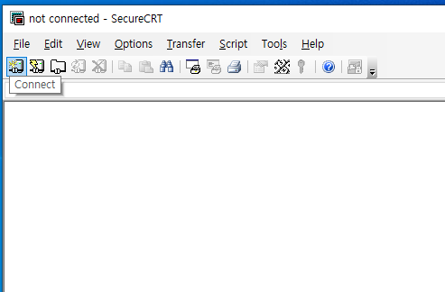

# 02_LINUX_SET_IP

## 1. CentOS

### 1.1 CentOS IP설정


- CentOS를 실행하고 로그인하자.


- 빈 화면에서 우클릭을 하고 **Open in Terminal 클릭**하자.


- 터미널 화면을 확인할 수 있다.

- 터미널 화면에서

  ```bash
  $ vi /etc/sysconfig/network-scripts/ifcfg-eth0
  ```

  를 입력하면 IP를 설정하는 파일을 볼 수 있다.


- 위의 사진처럼 vi 에디터가 열리게 된다. **i를 눌러 수정**을 시작하자.


- 위의 사진처럼 수정 및 추가하자.

  - `ONBOOT=yes` : OS가 부팅될 때 자동으로 네트워크를 활성화 시킬 것인지에 대한 여부

  - `BOOTPROTO=static` : IP를 dhcp로 할 것인지, 수동으로 할 것인지에 대한 여부

  - ```
    IPADDR=172.16.220.100 
    NETMASK=255.255.0.0
    GATEWAY=172.16.200.254
    DNS1=8.8.8.8
    ```
    
  - 유효한 IP임을 확인하고 싶다면, **윈도우의 `CMD(명령 프롬프트)`**에서 **`ping '위의 IP주소'`**를 입력한다.

  

  - **'대상 호스트에 연결할 수 없습니다.'이면 유효한 IP**이다.
  - IP사항을 보고싶다면 [나무위키 IP항목 참고](https://namu.wiki/w/IP)

- 수정 및 추가가 완료되었다면, **ESC**를 눌러 수정 모드를 벗어나자.

- 그리고 **SHIFT + ;(세미콜론) 즉 :(콜론)**을 누르고 **wq**로 저장 후 빠져나오자.

- `service network restart`를 입력하면, 네트워크를 재시작할 수 있다.


- 위의 화면처럼 나오면 활성화가 된 것이다.

- `ifconfig`를 입력해서 확인해보자.


- 정상적으로 작동하는지 확인하기 위해 ping을 보내본다.

  ```bash
  $ ping 8.8.8.8
  ```


- **위와 같이 되면 성공**이다.

### 1.2 CentOS SSH Server 구축

#### 1.2.1 SSH(Secure SHell) ?

- 인터넷과 같은 Public Network를 통해 통신을 할 때 **안전하게 통신**을 하기 위해 사용하는 프로토콜, [참고](https://baked-corn.tistory.com/52)

#### 1.2.2 SSH 설치

- ```bash
  $ yum install openssh-server
  ```


- 입력 후 모두 y를 입력하면 SSH Server 설치가 끝난다.

### 1.3 Putty, SecureCRT 설치 및 IP 연결

- **PuTTY** : 클라이언트로 동작하는 자유 및 오픈 소스 단말 에뮬레이터 응용 프로그램, [PuTTY 다운로드](https://www.putty.org/)
- **SecureCRT** : 상용 SSH 및 텔넷 클라이언트 및 터미널 에뮬레이터 응용 프로그램, [SecureCRT 다운로드](https://www.vandyke.com/products/securecrt/windows.html)
  - SecureCRT는 PuTTY와는 다르게 프로그램 내에서 **여러 세션 띄우기가 가능**하다.

#### 1.3.1 Putty

- 먼저, VirtualBox에서 CentOS를 서버를 구동시켜야 한다.(위의 설정이 끝났다면 OS를 켜놓기만 해도 무방)


- PuTTY 실행
- 호스트 이름에 위의 **CentOS에 설정한 IP주소**를 적어주고, 열기를 누르면 된다.


- 위와 같이 떴다면, CentOS에 ID와 비밀번호를 입력하자.


- 위와 같은 화면을 보고있다면, 성공적이다.
- 이제 번거롭게 CentOS의 Terminal을 열지 않아도 된다.

#### 1.3.2 SecureCRT

- PuTTY 때와 같이 CentOS를 VirtualBox를 이용해 먼저 켜주어야 한다.



- SecureCRT를 켜고 **Connect를 클릭**


- New Session...


- 위의 **IP주소를 입력**하고 다음...


- Session name을 입력해 주고 마침...


- CentOS의 아이디와 비밀번호를 입력한다.


- 성공했다면 위의 화면과 같다.

## 2. Ubuntu

### 2.1 Ubuntu IP설정


- Ubuntu에 로그인


- ```bash
  $ sudo vi /etc/network/interfaces
  ```


- 위의 사진 처럼 뜨면 **i를 눌러 편집을 시작**하자.

- CentOS 때처럼 IP가 유효한지를 확인하자.


- `iface enp0s3 inet`을 `static`으로 바꾸고

```
address 172.16.220.101
netmask 255.255.0.0
gateway 172.16.200.254
dns-nameservers 8.8.8.8 8.8.8.4
```

- **`ESC`**를 입력하고 **`SHIFT + ;(세미콜론)`**을 입력하고 **`wq`**를 입력해 저장 및 종료해 터미널로 빠져나가자.


- `reboot` 를 이용해 재시작하자.
- `ifconfig`를 이용해 확인해서 inet addr이 입력한 IP주소가 맞는지 확인하자.


- ```bash
  $ ping 8.8.8.8
  ```

- 위의 사진처럼 나오면 성공이다.

### 2.2 Ubuntu SSH Server 구축

- 먼저 Ubuntn 패키지 관리 툴인 apt를 업데이트 및 업그레이드 해주고, ssh를 설치하자.

  ```bash
  $ sudo apt update
  
  $ sudo dpkg --configure -a
  
  $ sudo apt upgrade
  
  $ sudo apt-get install ssh
  ```

### 2.3 PuTTY 및 SecureCRT 연결

- 1.3과 같음


