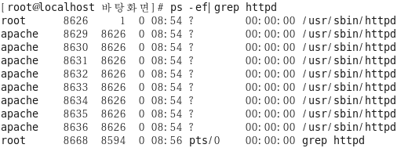
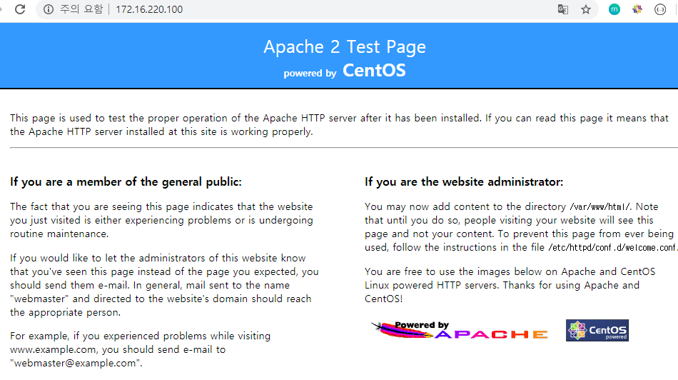
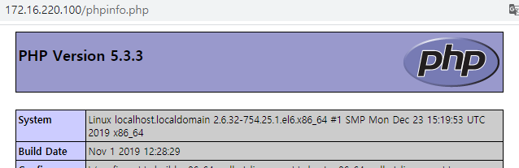
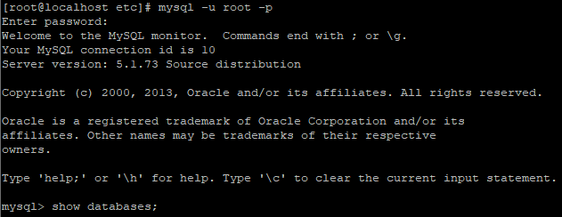
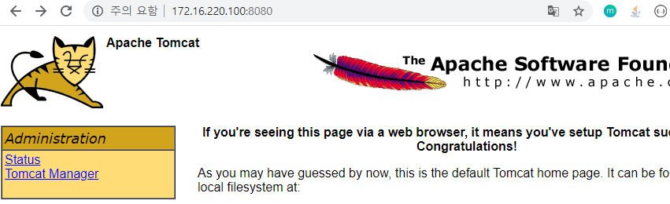
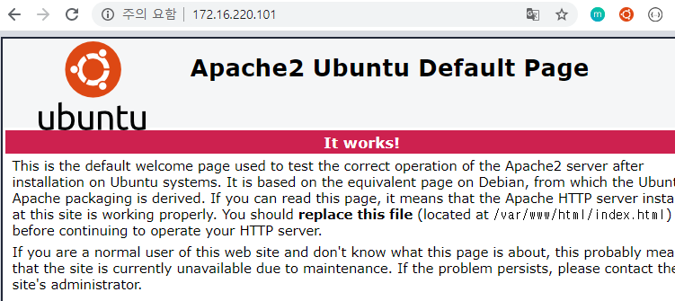
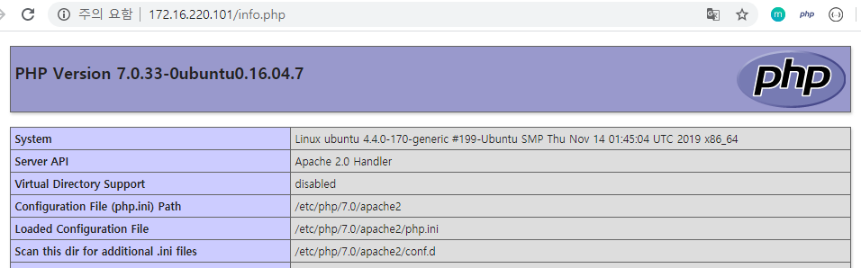
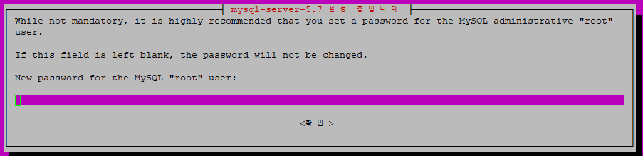
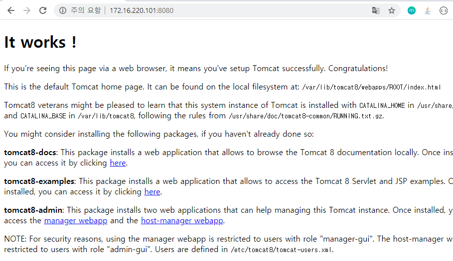

# 03_LINUX_APM/Tomcat

- **APM(Apache + PHP + MySQL)**


## 1. CentOS APM/Tomcat 설치

### 1.1 Apache 설치

- 설치되어 있는지 확인

  ```bash
  $ rpm -qa|grep httpd
  ```

- 설치 진행

  ```bash
  $ yum -y install httpd
  ```
  
- 버전 확인

  ```bash
  $ httpd -v
  ```

- Apache 시작

  ```bash
  $ service httpd start
  ```

- Server 실행 확인

  ```bash
  $ ps -ef|grep httpd
  ```

  

- 확인을 하기 위해서 방화벽 해제

  ```bash
  $ service iptables stop
  ```

- 브라우저에 CentOS IP를 입력 후 서버 확인

  

### 1.2 PHP 설치

- 설치되어 있는지 확인

  ```bash
  $ rpm -qa|grep php
  ```

- 설치 진행

  ```bash
  $ yum install php php-mysql
  ```

- 설치 확인

  - phpinfo.php 생성

    ```bash
    $ sudo vi /var/www/html/phpinfo.php
    ```

  - phpinfo.php 작성

    ```php
    <?php
        phpinfo();
    ?>
    ```

  - 브라우저에 IP/phpinfo.php 접속

    

### 1.3 MySQL 설치

- 설치되어 있는지 확인

  ```bash
  $ rpm -qa | grep ^mysql-server
  ```

- 설치 진행

  ```bash
  $ yum install mysql-server
  ```

- 서비스 시작

  ```bash
  $ service mysqld start
  ```

- MySQL 패스워드 지정

  ```bash
  $ /usr/bin/mysql_secure_installation
  ```

- MySQL 접속 및 databases 확인

  ```bash
  $ mysql -u root -p
  
  $ show databases;
  ```

  

### 1.4 Tomcat 설치

- **Tomcat ?**
  - 동적(Dynamic)인 웹을 만들기 위한 웹 컨테이너, 서블릿 컨테이너라고 불리며, 웹서버에서 정적으로 처리해야할 데이터를 제외한 JSP, ASP, PHP 등은 웹 컨테이너(Tomcat)에게 전달한다.

- 톰켓을 설치하기 전에 앞서 **포트 충돌 방지**를 위해서 Apache 서버를 stop 시켜주자.

  ```bash
  $ service httpd stop
  ```

- 설치 확인

  ```bash
  $ yum list installed | grep tomcat
  ```

- 설치 진행

  ```bash
  $ yum install -y tomcat*
  ```

- 서비스 시작

  ```bash
  $ netstat -tnlp
  
  $ service tomcat6 status	# 상태 확인
  
  $ service tomcat6 start		# 서비스 시작
  ```

- 브라우저에 IP/포트

  

## 2. Ubuntu APM/Tomcat 설치

### 2.1 Apache 설치

- 설치

  ```bash
  $ sudo apt install apache2
  ```

- 설치 확인

  ```bash
  $ apache2 -v
  ```

- 브라우저에서 ubuntu IP를 입력 후 서버 확인

  

### 2.2 PHP 설치

- 설치

  ```bash
  $ sudo apt install php php-mysql
  
  $ sudo apt install libapache2-mod-php7.0
  
  $ sudo a2enmod php7.0
  ```

- 설치 확인

  ```bash
  $ php -v
  ```

- 서버 재시작 또는 재부팅

  ```bash
  $ sudo systemctl restart apache2.service 
  or
  $ reboot
  ```

- 서버 확인

  ```bash
  $ sudo vi /var/www/html/info.php
  ```

  ```php
  <?php
      phpinfo();
  ?>
  ```

- 브라우저에 IP 입력후 info.php 입력

  

- 위의 사진같이 출력되면 성공이다.

### 2.3 MySQL 설치

- 설치

  ```bash
  $ sudo apt-get install mysql-server
  ```

- 설치가 완료되면 MySQL root계정의 비밀번호를 새로 입력하라는 매시지가 나온다.

  

- 한번 더 입력하면 완료된다.

### 2.4 Tomcat 설치

- 설치

  ```bash
  $ sudo apt-get install tomcat8
  ```

- 버전 확인

  ```bash
  $ sudo /usr/share/tomcat8/bin/version.sh
  ```

- 방화벽에서 톰켓의 포트를 외부 접속이 가능하도록 변경

  ```bash
  $ sudo ufw allow 8080/tcp
  ```

- 서비스 실행

  ```bash
  $ sudo service tomcat8 start
  ```

  

