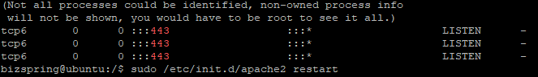
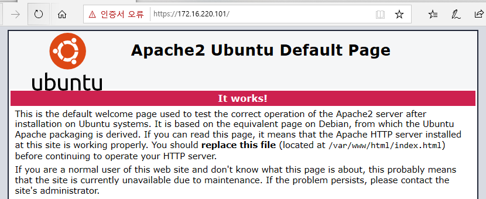

# 04_LINUX_SSL

- **SSL(Secure Sockets Layer)**
  - 웹 서버 인증, 서버 인증이라고 불리는, 클라이언트와 서버의 **통신을 제 3자가 보증해주는 전자화된 문서**

  - **이점** 
    - 통신 내용이 공격자에게 **노출되는 것을 막을 수 있다**.
    - 클라이언트가 접속하려는 서버가 **신뢰할 수 있는 서버인지를 판단**할 수 있다.
    - 통신 내용의 **악의적인 변경을 방지**할 수 있다.

- **SSL과 HTTPS는 같은 것일까?**
  - HTTPS는 SSL 프로토콜 위에서 돌아가는 프로토콜
  - HTTPS로 데이터 전송을 시작할 때, SSL이 데이터 보안을 제공

## 1. Ubuntu

### 1.1 OpenSSL 설치 및 인증서 생성

- apt-get 패키지 업데이트

  ```bash
  $ sudo apt-get update
  ```

- OpenSSL 설치 확인

  ```bash
  $ sudo openssl version
  ```

- OpenSSL 설치

  ```bash
  $ sudo apt-get install openssl
  ```

#### 1.1.1 개인키 생성

- 개인키 생성

  ```bash
  $ sudo openssl genrsa -des3 -out server.key 2048
  
  Generating RSA private key, 2048 bit long modulus
  ..+++
  ................+++
  e is 65537(0x10001)
  Enter pass phrase for server.key:
  Verifying - Enter pass phrase for server.key
  ```

- `Enter pass phrase for server.key` : 임의의 개인키 암호를 입력

#### 1.1.2 인증요청서(Certificate Sinning Request, CSR) 생성

- CSR 생성

  ```bash
  $ sudo openssl req -new -days 365 -key server.key -out server.csr # 365는 유효기간 생략可
  Enter pass phrase for server.key:	# 위에서 만든 개인키를 입력
  ```

- 각종 정보 입력

  ```bash
  Country Name (2 letter code) [AU] : KR
  State or Province Name (full name) [Some-State] : Seoul
  Locality Name (eg, city) [] :
  Organization Name (eg, company) [Internet Widgits Pty Ltd] :
  Organizational Unit Name (eg, section) [] :
  Common Name (e.g. server FQDN or YOUR name) [] :
  Email Address [] :
  ```

- 추가 정보 입력(Enter 두번으로 그냥 넘어가자)

  ```bash
  Please enter the following 'extra' attributes
  to be sent with your certificate request
  A challenge password [] :
  An optional company name [] :
  ```

#### 1.1.3 개인키 패스워드 제거

> - 개인키에 패스워드가 있으면 아파치 구동 시마다 물어본다.
> - 편의를 위해 개인키 패스워드를 제거한다. 패스워드를 제거하더라도 SSL에는 문제가 없다.

- 기존 개인키 복사

  ```bash
  $ sudo cp server.key server.keyorigin
  ```

- 개인키 패스워드 제거

  ```bash
  $ sudo openssl rsa -in server.key.origin -out server.key
  Enter pass phrase for server.key.origin:	# 개인키 입력
  ```

#### 1.1.4 인증서 생성

- 개인키와 인증 요청서를 가지고 인증서를 생성

  ```bash
  $ sudo openssl x509 -req -days 365 -in server.csr -signkey server.key -out server.crt
  ```

- 성공 시

  ```bash
  Signature ok
  subject=/C=KR/ST=Seoul/L={ local }/O={ company }/OU={ section }/CN={ name }/emailAddress={ email }
  Getting Private key
  ```

#### 1.1.5 인증서 확인

- 인증서 확인

  ```bash
  $ ls -l server*
  ```

- 개인키 확인

  ```bash
  $ cat server.key | head -3
  -----BEGIN RSA PRIVATGE KEY-----
  ```

- 인증서 확인

  ```bash
  $ cat server.crt | head -3
  -----BEGIN CERTIFICATE-----
  ```


### 1.2 Apache에 SSL 적용

#### 1.2.1 SSL 디렉토리 생성 및 인증서 복사

- 관리의 편의를 위해 ssl 인증서를 모아둘 디렉토리를 생성

  ```bash
  $ sudo mkdir /etc/apache2/ssl
  ```

- 생성된 디렉토리로 인증서를 복사

  ```bash
  $ sudo cp server.crt /etc/apache2/ssl/server.crt
  $ sudo cp server.csr /etc/apache2/ssl/server.csr
  $ sudo cp server.key /etc/apache2/ssl/server.key
  ```

- 복사 확인

  ```bash
  $ cd /etc/apache2/ssl/
  $ ls
  server.crt	server.csr	server.key
  ```

#### 1.2.2 SSL 모듈 활성

```bash
$ sudo a2enmod ssl
```

#### 1.2.3 /etc/apache2/ports.conf 파일 수정

```bash
$ sudo vi /etc/apache2/ports.conf

# 내용 추가
<IfModule mod_ssl.c>
	LISTEN 443
</IfModule>
```

#### 1.2.4 default-ssl.conf 파일 복사

- default-ssl.conf 파일을 복사해서 board-ssl.conf로 이름을 변경하였따.
- 복사한 파일명은 본인이 알기 쉽게 정하면 된다.

```bash
$ sudo cp /etc/apache2/sites-available/default-ssl.conf /etc/apache2/sites-available/board-ssl.conf
```

#### 1.2.5 복사한 파일 수정

- 위에서 복사한 파일을 수정

  ```bash
  $ sudo vi /etc/apache2sites-available/board-ssl.conf
  
  # 해당부분 확인
  SSLEngine on
  
  # 해당부분 수정
  SSLCertificateFile /etc/apache2/ssl/server.crt
  SSLCertificateKeyFile /etc/apache2/ssl/server.key
  
  # #을 제거
  #SSLOptions +FakeBasicAuth +ExportCertData +StrictRequire
  ```

#### 1.2.6 board-ssl 활성화

```bash
$ sudo a2ensite board-ssl
```

#### 1.2.7 방화벽 설정

- 방화벽에 OpenSSL의 포트인 443 포트로 접속을 허용하도록 변경

  ```bash
  $ sudo ufw allow 443/tcp
  ```

- 설정 후 443 포트 확인

  ```bash
  $ netstat -anp | grep LISTEN | grep 443
  ```

- 정상적으로 동작 시

  

#### 1.2.8 아파치 재시작

```bash
$ sudo /etc/init.d/apache2 restart
```

#### 1.2.9 SSL 적용 확인

- `https://IP` 접속 시


- 웹 페이지로 이동 시

  
  
## 2. CentOS

http://egloos.zum.com/guswl47/v/6514311

### 2.1 OpenSSL 설치 및 인증서 생성

- CentOS 6 이상 버전은 기본적으로 OpenSSL 패키지가 설치되어 있다.

- 설치 확인

  ```bash
  $ rpm -qa openssl
  or
  $ openssl version
  ```

#### 2.1.1 개인키 생성

```bash
$ openssl genrsa -des3 -out server.key 2048
```

#### 2.1.2 인증요청서(Certificate Sinning Request, CSR) 생성

```bash
$ openssl req -new -key server.key -out server.csr

# 개인키 입력
Enter pass phrase for server.key:
...

# 각종 정보입력
Country Name (2 letter code) [XX] : KR
State or Province Name (full name) [] :Seoul
Locality Name (eg, city) [Default City] :
Organizational Name (eg, company) [Default Company Ltd] :
Organizational Unit Name (eg, section) [] : 
Common Name (eg, your name or your server's hostname) [] : 
Email Address [] : 
...

# 추가 정보 입력 Enter 2번을 넘어가자
Please enter the following 'extra' attributes
to be sent with your certificate request
A challenge password [] :
An optional company name [] :
```

#### 2.1.3 개인키 패스워드 제거

```bash
$ cp server.key server.key.origin
$ openssl rsa -in server.key.origin -out server.key
Enter pass phrase for server.key.origin:
```

#### 2.1.4 인증서 생성

```bash
$ openssl x509 -req -days 365 -in server.csr -signkey server.key -out server.crt
```

#### 2.1.5 인증서 확인

```bash
$ cat server.key | head -3
$ cat server.crt | head -3
```

#### 2.1.6 개인키와 인증서 설치

- 해당 디렉토리에 위치해야만 SSL 서비스를 제대로 제공해줄 수 있다.

```bash
$ cp server.crt /etc/pki/tls/certs
$ cp server.key /etc/pki/tls/private/server.key
$ cp server.csr /etc/pki/tls/private/server.csr
```

